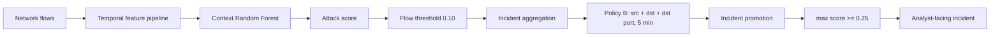

# Security Anomaly ML

An open-source machine-learning system for network anomaly detection that turns high-volume flow detections into analyst-facing security incidents.

The project is built around a simple operational question: can a network-flow detector keep attack coverage high while reducing the number of objects a SOC analyst must review?

Current status: **Acceptable but operationally noisy.** The frozen pipeline generalized well at incident level on a locked temporal holdout, but it is not production-ready.

## Architecture



## Locked temporal holdout

The final v2 pipeline was frozen before February 18 evaluation. February 18 was never used for training, feature selection, threshold selection, aggregation selection, or promotion selection. No post-holdout tuning, suppression, or whitelisting was performed.

| Metric | Feb 18 holdout |
|---|---:|
| Flow recall | 98.3686% |
| Flow precision | 67.5499% |
| Flow FPR | 2.1190% |
| ROC-AUC | 0.996155 |
| PR-AUC | 0.898915 |
| Aggregated incident recall | 99.9917% |
| Promoted incident recall | 99.9339% |
| Promoted incident precision | 93.46% |
| Flow-alert to incident reduction | 83.80% |
| FP-object reduction | 96.74% |

The flow detector missed the pre-existing 98.5% recall research gate by 0.1314 percentage point. Incident-level detection remained stable because multiple flows from the same security event often contributed evidence to one incident.

### Workload reduction

| Stage | Volume | FP volume | Recall | Precision | Rate/hour | FP/hour |
|---|---:|---:|---:|---:|---:|---:|
| Flow detector | 79,710 alerts | 25,866 flows | 98.3686% | 67.55% | 9,388.39 | 3,046.54 |
| Policy B / 5 min | 13,795 incidents | 1,721 incidents | 99.9917% | 87.52% | 1,624.80 | 202.70 |
| + promotion | 12,911 incidents | 844 incidents | 99.9339% | 93.46% | 1,520.68 | 99.41 |

The remaining workload is still too high for a normal Tier-1 queue. The project therefore does not claim production readiness.

## Temporal design

V2 uses the CIC-UNSW-NB15 flow export and a fixed capture-day split:

```text
2015-01-22 -> train          1,765,922 flows
2015-02-17 -> validation       498,890 flows
2015-02-18 -> locked holdout 1,275,429 flows
```

Raw IP addresses and timestamps are used only to construct causal context and incident identity. They are not model features.

The feature builder enforces tie-safe causality. CICFlowMeter timestamps have one-second precision and many flows share the same timestamp. Every flow at time `t` can use state only from timestamps strictly earlier than `t`. Same-second flows are updated as one group after scoring. Context is reset at split boundaries.

The v2 feature contract contains:

- 76 numeric CICFlowMeter flow features;
- 9 numeric port/protocol behavioral representations;
- 43 temporal context features;
- 128 model features total.

Examples of context features include short-window source/destination connection counts, distinct endpoints and ports, repeated source-destination activity, rolling packets and bytes, protocol ratios, flag activity, port diversity, and time since prior related flows.

## Model development

The main v2 candidate is a Random Forest:

```python
RandomForestClassifier(
    n_estimators=300,
    max_depth=24,
    min_samples_split=5,
    min_samples_leaf=2,
    max_features=0.5,
    max_samples=0.8,
    bootstrap=True,
    random_state=42,
    n_jobs=-1,
)
```

On February 17 validation, adding temporal context reduced false positives by 37.7% relative to the 76-feature baseline while preserving the 98.5% attack-recall gate.

| Validation metric | Baseline v2 | Context v2 |
|---|---:|---:|
| Threshold | 0.06 | 0.10 |
| Recall | 98.5957% | 98.5908% |
| Precision | 50.8612% | 62.4269% |
| PR-AUC | 0.781595 | 0.847746 |
| FPR | 4.0541% | 2.5255% |
| False positives | 19,400 | 12,085 |

Further score blending, Fuzzer-only weighting, and temporal stacking were evaluated without opening the holdout. They did not produce a large enough operational improvement to justify replacing the frozen Context model.

## Incident layer

Flow-level FPR is not the same as analyst workload. Repeated alerts are grouped into incidents.

The selected aggregation policy is:

```text
key: src_ip + dst_ip + dst_port
window: 5 minutes
```

On February 17 this converted 32,164 flow alerts into 5,408 incidents, an 83.19% reduction, with 99.978% attack-incident recall.

A deterministic incident promotion rule was selected only from causal January OOF scores:

```text
promote if max_attack_score >= 0.25
```

On February 17 it reduced pure-FP incidents from 870 to 739 while keeping incident recall at 99.9121%. The rule was then frozen before February 18.

## Category behavior

The final holdout exposed concentrated flow-level weaknesses:

| Category | Flow recall | Promoted incident recall |
|---|---:|---:|
| Fuzzers | 95.4874% | 100.0000% |
| Analysis | 76.3441% | 100.0000%* |
| Exploits | 99.8590% | 99.9493% |
| DoS | 99.9637% | 99.9468% |
| Reconnaissance | 99.9711% | 99.9576% |
| Generic | 99.8958% | 99.8968% |
| Backdoor | 100.0000% | 99.5575% |
| Shellcode | 100.0000% | 100.0000% |
| Worms | 100.0000% | 100.0000% |

`*` Analysis contains only 10 reference incidents on February 18, so the incident estimate is unstable.

## Repository layout

```text
security-anomaly-ml/
├── src/
│   ├── explore_cic_unsw_nb15.py
│   ├── build_temporal_features.py
│   ├── train_v2_ablation.py
│   ├── analyze_v2_ensemble.py
│   ├── train_v2_fuzzer_weighting.py
│   ├── train_v2_temporal_stacking.py
│   ├── analyze_incident_aggregation.py
│   ├── analyze_incident_promotion.py
│   └── evaluate_v2_feb18_holdout.py
├── tests/
├── data/
│   ├── raw/
│   └── processed/
├── models/
├── requirements.txt
├── LICENSE
└── README.md
```

Raw datasets, generated Parquet score files, and trained model binaries are intentionally excluded from Git history.

## Setup

Python 3.11 or newer is recommended.

Windows PowerShell:

```powershell
py -3.11 -m venv .venv
.\.venv\Scripts\Activate.ps1
python -m pip install -r requirements.txt
```

Linux/macOS:

```bash
python3 -m venv .venv
source .venv/bin/activate
python -m pip install -r requirements.txt
```

Run tests:

```bash
python -m pytest -q
```

The development environment used during the locked experiment reported 34 passing tests. Some reproduction paths require the large source datasets and generated intermediate artifacts that are not stored in this repository.

## Reproduction path

After obtaining the required datasets:

```bash
python src/explore_cic_unsw_nb15.py
python src/build_temporal_features.py --memory-limit 10GB --threads 8
python src/train_v2_ablation.py
python src/analyze_v2_ensemble.py
python src/train_v2_fuzzer_weighting.py
python src/train_v2_temporal_stacking.py
python src/analyze_incident_aggregation.py --memory-limit 10GB --threads 8
python src/analyze_incident_promotion.py --memory-limit 10GB --threads 8
```

`evaluate_v2_feb18_holdout.py` is retained for audit and reproduction of the already-completed locked evaluation. It should not be treated as permission to tune on February 18.

## Datasets

The project uses two related public research datasets at different stages:

- UNSW-NB15, published by UNSW Canberra;
- CIC-UNSW-NB15, a CICFlowMeter export derived from UNSW-NB15 packet captures and published by the Canadian Institute for Cybersecurity.

Dataset files are not redistributed here. Obtain them from their publishers and comply with the original terms and citation requirements. Third-party datasets are not covered by this repository's Apache-2.0 license.

## Limitations

- The holdout is one future capture day, not evidence across many independent networks.
- Endpoint populations overlap across capture days.
- CICFlowMeter timestamps have only one-second precision.
- The model score is not a calibrated real-world probability.
- Fuzzers and Analysis remain weaker at flow level.
- The promoted incident rate is still too high for normal production Tier-1 operations.
- No entity whitelist or port suppression was used, by design.
- No claim of production readiness is made.

## License

Original source code in this repository is licensed under Apache License 2.0. Dataset licenses and terms remain with their original publishers.
