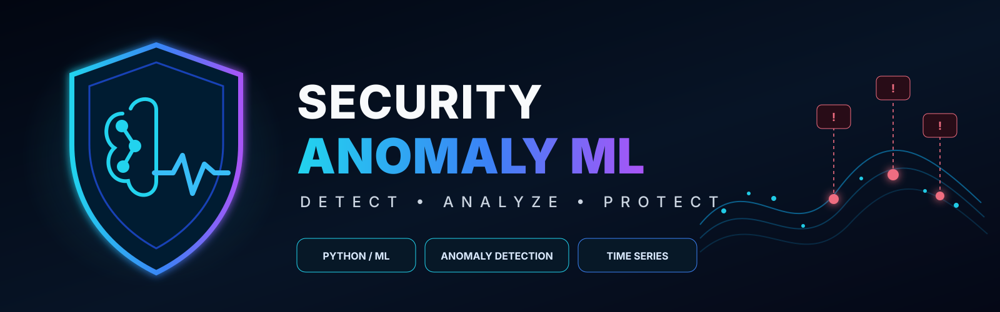
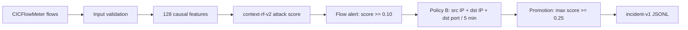

.

# Security Anomaly ML

Open-source ML network-flow detector that turns CICFlowMeter-compatible traffic into deterministic analyst-facing security incidents.

[](https://github.com/ibondarenko1/security-anomaly-ml/actions/workflows/ci.yml)
[](https://github.com/ibondarenko1/security-anomaly-ml/releases/tag/v0.1.0)
[](https://www.python.org/)
[](./LICENSE)
[](https://doi.org/10.5281/zenodo.22036212)

**v0.1.0 — usable research/evaluation release. Not production-ready.**

Security Anomaly ML takes unlabeled CICFlowMeter flow records, builds causal temporal context, scores them with a frozen Random Forest detector, groups repeated alerts into incidents, and emits deterministic `incident-v1` JSONL.

## Quick start

Docker is the recommended path. The published image includes the exact verified frozen model, so no separate model download is needed.

```bash
docker pull ghcr.io/ibondarenko1/security-anomaly-ml:0.1.0

docker run --rm --network none \
  -v "$PWD:/data" \
  ghcr.io/ibondarenko1/security-anomaly-ml:0.1.0 \
  analyze /data/flows.csv \
  --output /data/incidents.jsonl
```

The mounted directory must be writable by the container's non-root UID/GID `10001`. Normal inference works with networking disabled. Validation, Windows PowerShell, and source-build examples are in [`docs/DOCKER.md`](docs/DOCKER.md).

## Example incident

The output is newline-delimited `incident-v1` JSON. Each object contains a deterministic incident ID, first/last timestamps, endpoints, destination port, protocols, flow count, aggregate attack scores, and frozen version metadata.

```json
{
  "schema_version": "incident-v1",
  "incident_id": "inc_e05487e368f9e26a2a6939c7be622de508056478d3876c344c77a53ba4214872",
  "first_seen": "2026-08-20T13:00:00",
  "last_seen": "2026-08-20T13:00:05",
  "src_ip": "192.0.2.10",
  "dst_ip": "198.51.100.20",
  "dst_port": 445,
  "protocols": [6, 17],
  "flow_count": 3,
  "max_attack_score": 0.432590909091,
  "mean_attack_score": 0.418368686869,
  "promoted": true,
  "product_version": "0.1.0",
  "model_version": "context-rf-v2",
  "feature_contract": "cicflow-v2-128"
}
```

The public interface emits promoted incidents rather than individual ML predictions, reducing repeated flow alerts into deterministic analyst-facing objects.

The synthetic regression fixture at [`tests/fixtures/product-v01/flows.csv`](tests/fixtures/product-v01/flows.csv) deterministically produces:

- 12 processed flows;
- 9 flow alerts;
- 5 aggregated incidents;
- 2 promoted incidents.

These numbers test runtime stability; they are **not an accuracy benchmark** and contain no copied research-dataset rows.

## Locked temporal validation

The v0.1 pipeline was frozen before evaluation on the February 18 temporal holdout. No thresholds, features, model parameters, aggregation rules, promotion rules, suppression, or whitelisting were changed after opening it.

| Metric | Locked holdout |
|---|---:|
| Flow recall | 98.3686% |
| Flow precision | 67.5499% |
| Flow FPR | 2.1190% |
| PR-AUC | 0.898915 |
| Aggregated incident recall | 99.9917% |
| Promoted incident recall | 99.9339% |
| Promoted incident precision | 93.46% |
| Flow-alert to incident reduction | 83.80% |
| FP-object reduction | 96.74% |

**Verdict: acceptable but operationally noisy.** This is one future capture day with overlapping hosts/environment from the same dataset and network family. It is not evidence of generalization across arbitrary networks, and the remaining workload is too high for normal Tier-1 production use.

The holdout was evaluated once after all model, feature, threshold, aggregation, and promotion decisions were frozen.

## How it works

One input row represents one network flow. The product validates the label-free CSV, builds tie-safe causal context, scores each flow, groups flow alerts into deterministic five-minute incidents, and emits only promoted incidents.



The frozen feature contract is:

```text
76 CICFlowMeter flow features
+ 9 static port/protocol behavioral features
+ 43 causal temporal-context features
= 128 model features
```

Raw IP addresses and timestamps provide temporal and incident context but are not model identity features. Same-timestamp flows are processed as one peer group: all peers are featurized before that timestamp updates state.

## Input format

Input must be a UTF-8 CICFlowMeter-compatible CSV containing:

- `Src IP`, `Src Port`, `Dst IP`, `Dst Port`, `Protocol`, and `Timestamp`;
- all 76 baseline numeric fields defined by [`cicflow-v2-128`](contracts/feature-contract-cicflow-v2-128.json);
- optional `Flow ID`.

`Label`, `label`, and `attack_cat` are not required and are removed if present. Validation rejects missing or duplicate columns, reserved derived fields, malformed timestamps, invalid ports/protocols, and non-numeric or non-finite model inputs. Source timestamps are timezone-naive; v0.1 does not invent a timezone.

Use `validate` before analysis when integrating a new exporter:

```bash
security-anomaly validate flows.csv
```

## Docker

The immutable release tag is:

```text
ghcr.io/ibondarenko1/security-anomaly-ml:0.1.0
```

It includes Python 3.13, the installed package, contracts, pinned runtime dependencies, and the verified model. It runs as non-root and requires no network during inference. Build and operational details are in [`docs/DOCKER.md`](docs/DOCKER.md).

No mutable `latest` tag is published for v0.1.0.

## Python CLI

Download the wheel from the [v0.1.0 GitHub Release](https://github.com/ibondarenko1/security-anomaly-ml/releases/tag/v0.1.0), then install it into Python 3.13:

```bash
python3.13 -m venv .venv
source .venv/bin/activate
python -m pip install security_anomaly_ml-0.1.0-py3-none-any.whl
security-anomaly version
```

The Python wheel intentionally does not embed the model. Obtain the existing artifact from the [`model-context-rf-v2` release](https://github.com/ibondarenko1/security-anomaly-ml/releases/tag/model-context-rf-v2), or from a source checkout run:

```bash
python tools/fetch_frozen_model.py \
  --tag model-context-rf-v2 \
  --destination models/context-rf-v2.joblib

security-anomaly model-info --model models/context-rf-v2.joblib
security-anomaly analyze flows.csv \
  --model models/context-rf-v2.joblib \
  --output incidents.jsonl
```

The downloader verifies the frozen SHA-256 before success and never silently replaces a different file. Full CLI behavior and exit codes are documented in [`docs/CLI.md`](docs/CLI.md).

## Reproducibility and CI

Public CI runs on every pull request and push to `main` and requires only a clean checkout plus the public frozen-model release. It verifies:

- unit and frozen-contract tests;
- pinned runtime dependency vulnerability audit;
- clean wheel/sdist build and outside-checkout installation;
- public model download and SHA verification;
- real-model end-to-end golden regression;
- non-root offline Docker build and byte-identical golden output;
- exclusion of datasets and research artifacts from the runtime image.

Goldens are never rewritten automatically. Details are in [`docs/CI.md`](docs/CI.md).

## Model artifact

| Field | Frozen value |
|---|---|
| Model version | `context-rf-v2` |
| Release tag | [`model-context-rf-v2`](https://github.com/ibondarenko1/security-anomaly-ml/releases/tag/model-context-rf-v2) |
| Filename | `context-rf-v2.joblib` |
| SHA-256 | `4730a06506d8c5f2af93679c492e1544b3c2b11acd16fe74120d64d4dbfc5c72` |
| Python | `3.13.7` |
| Feature builder | `causal-temporal-v2` |
| Feature contract | `cicflow-v2-128` |
| Flow threshold | `>= 0.10` |
| Incident policy | Policy B, gap `> 300s` |
| Promotion | `max_attack_score >= 0.25` |

Scores are ranking signals, not calibrated real-world probabilities. The model is excluded from Git history and is never reserialized by the product build.

## Security and privacy

Security Anomaly ML processes sensitive network-flow metadata locally. Normal inference performs no telemetry, cloud upload, hidden download, or other outbound network call; the Docker path is tested with `--network none`.

- Vulnerability reporting: [`SECURITY.md`](SECURITY.md)
- Data handling and privacy: [`docs/PRIVACY.md`](docs/PRIVACY.md)

Do not attach real packet captures, raw flow exports, internal IP inventories, or unredacted incidents to public issues.

## Limitations

- Research/evaluation grade; not production-ready and not a SOC replacement.
- Batch CSV processing only; no streaming, API, dashboard, or persistent state service.
- CICFlowMeter-compatible input only.
- Frozen Python 3.13 serialization/runtime compatibility.
- Input timestamps have source-defined, timezone-naive semantics and one-second granularity.
- Validation covers one future day from an overlapping network/dataset family, not arbitrary networks.
- Flow-level weaknesses remain concentrated in Fuzzers and Analysis traffic.
- The score is not calibrated as a real-world attack probability.
- Alert workload remains too high for normal Tier-1 production operations.

## Research methodology

The production-facing v0.1 pipeline was selected using chronological capture days:

```text
2015-01-22 -> training
2015-02-17 -> validation
2015-02-18 -> locked temporal holdout
```

Temporal context resets at split and batch boundaries. February 18 was not used for training, feature selection, threshold selection, aggregation selection, or promotion selection. Research scripts remain available for audit, but datasets and generated evaluation artifacts are not redistributed.

The research uses UNSW-NB15 and CIC-UNSW-NB15 under their publishers' terms. Third-party dataset terms are not covered by this repository's Apache-2.0 license.

## Repository layout

```text
security-anomaly-ml/
├── src/security_anomaly/      # label-free product runtime
├── src/*.py                   # research and reproduction tooling
├── contracts/                 # versioned feature/model/incident contracts
├── tests/
│   └── fixtures/product-v01/  # deterministic public regression fixture
├── docs/                      # CLI, Docker, CI, privacy, and design docs
├── tools/                     # artifact and parity verification helpers
├── data/                      # ignored external datasets and derived data
├── models/                    # ignored external model/evaluation artifacts
├── Dockerfile
├── pyproject.toml
├── requirements-runtime.txt
└── README.md
```

## Development and tests

Python 3.13 is required for the frozen product runtime.

```bash
python3.13 -m venv .venv
source .venv/bin/activate
python -m pip install -r requirements.txt
python -m pytest -q
```

Some research-reproduction tests require non-redistributed datasets or generated artifacts and skip explicitly in a clean public checkout. Product CI is fully reproducible from public inputs.

## License

Original source code is licensed under the [Apache License 2.0](LICENSE). Dataset licenses and terms remain with their original publishers.
