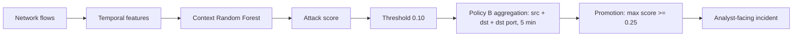

# Security Anomaly ML

Open-source machine-learning system for network anomaly detection that converts high-volume network-flow detections into analyst-facing security incidents.

Current status: **Acceptable but operationally noisy.** The frozen v2 pipeline generalized well at incident level on a locked February 18 temporal holdout, but it is not production-ready.

## Architecture



## Locked holdout results

The final pipeline was frozen before February 18 evaluation. The holdout was never used for training, feature selection, threshold selection, aggregation selection, or promotion selection. No post-holdout tuning, whitelisting, or suppression was performed.

| Metric | Feb 18 |
|---|---:|
| Flow recall | 98.3686% |
| Flow precision | 67.5499% |
| Flow FPR | 2.1190% |
| ROC-AUC | 0.996155 |
| PR-AUC | 0.898915 |
| Aggregated incident recall | 99.9917% |
| Promoted incident recall | 99.9339% |
| Promoted incident precision | 93.46% |
| Alert-to-incident reduction | 83.80% |
| FP-object reduction | 96.74% |

| Stage | Volume | FP volume | Recall | Precision | Rate/hour | FP/hour |
|---|---:|---:|---:|---:|---:|---:|
| Flow detector | 79,710 | 25,866 | 98.3686% | 67.55% | 9,388.39 | 3,046.54 |
| Policy B / 5 min | 13,795 | 1,721 | 99.9917% | 87.52% | 1,624.80 | 202.70 |
| + promotion | 12,911 | 844 | 99.9339% | 93.46% | 1,520.68 | 99.41 |

The remaining incident rate is still too high for a normal production Tier-1 queue.

## Temporal experiment

V2 uses CIC-UNSW-NB15 with a fixed capture-day split:

```text
2015-01-22 -> train          1,765,922 flows
2015-02-17 -> validation       498,890 flows
2015-02-18 -> locked holdout 1,275,429 flows
```

Raw IP addresses and timestamps are used only for causal context and incident identity. They are not model features. Same-second flows cannot see each other during feature construction; each flow at time t uses only state from timestamps strictly earlier than t.

The Context candidate uses 128 features: 76 CICFlowMeter flow features, 9 port/protocol behavioral features, and 43 temporal context features.

On February 17 validation, temporal context reduced false positives by 37.7% relative to the 76-feature baseline while preserving the 98.5% attack-recall gate.

| Validation metric | Baseline | Context |
|---|---:|---:|
| Threshold | 0.06 | 0.10 |
| Recall | 98.5957% | 98.5908% |
| Precision | 50.8612% | 62.4269% |
| PR-AUC | 0.781595 | 0.847746 |
| FPR | 4.0541% | 2.5255% |
| False positives | 19,400 | 12,085 |

Further ensemble, weighting, and temporal-stacking experiments did not produce enough operational gain to replace the frozen Context model.

## Incident layer

Selected aggregation:

```text
key: src_ip + dst_ip + dst_port
window: 5 minutes
```

Selected promotion rule, chosen from causal January OOF scores before Feb 17 validation:

```text
promote if max_attack_score >= 0.25
```

On February 17 aggregation reduced 32,164 flow alerts to 5,408 incidents with 99.978% incident recall.

## Setup

Python 3.11+ is recommended.

```bash
python -m venv .venv
python -m pip install -r requirements.txt
python -m pytest -q
```

Raw datasets, generated Parquet score files, and trained model binaries are intentionally excluded from Git history.

## Reproduction path

```bash
python src/explore_cic_unsw_nb15.py
python src/build_temporal_features.py --memory-limit 10GB --threads 8
python src/train_v2_ablation.py
python src/analyze_v2_ensemble.py
python src/train_v2_fuzzer_weighting.py
python src/train_v2_temporal_stacking.py
python src/analyze_incident_aggregation.py --memory-limit 10GB --threads 8
python src/analyze_incident_promotion.py --memory-limit 10GB --threads 8
```

`evaluate_v2_feb18_holdout.py` is retained only for audit/reproduction of the completed locked evaluation.

## Datasets

The project uses UNSW-NB15 and CIC-UNSW-NB15. Dataset files are not redistributed. Obtain them from their original publishers and comply with their licenses, terms, and citation requirements. Third-party datasets are not covered by this repository's Apache-2.0 license.

## Limitations

- One future capture day is not evidence across many independent networks.
- Endpoint populations overlap across capture days.
- CICFlowMeter timestamps have one-second precision.
- Attack scores are not calibrated real-world probabilities.
- Fuzzers and Analysis remain weaker at flow level.
- Analyst-facing volume is still too high for production Tier-1 use.
- No production-readiness claim is made.

## License

Original source code is licensed under Apache License 2.0. Dataset terms remain with the original publishers.
